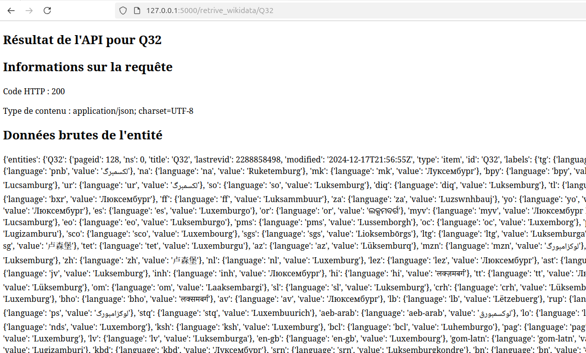
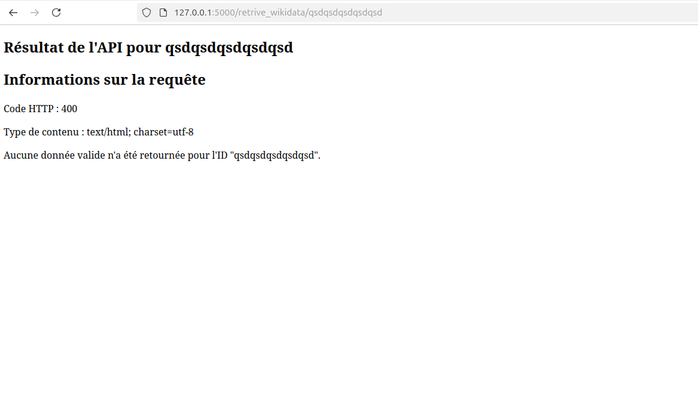

# Application Flask : les routes

Récupère les données via l'API de Wikidata via la route /retrive_wikidata.

> Exemple de lien avec les URI de wikidata : http://127.0.0.1:5000/retrive_wikidata/Q32



---



## Requirements

```
blinker==1.9.0
certifi==2024.12.14
charset-normalizer==3.4.0
click==8.1.8
Flask==3.1.0
idna==3.10
itsdangerous==2.2.0
Jinja2==3.1.5
MarkupSafe==3.0.2
python-dotenv==1.0.1
requests==2.32.3
urllib3==2.3.0
Werkzeug==3.1.3
```

Installation :

```
pip install Flask && pip install python-dotenv
```


